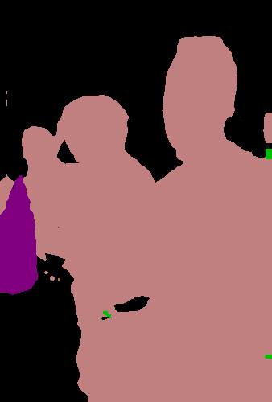

# DeepLabV2
# Keras implementation of DeepLabV2 
DeepLab is a state-of-art deep learning model for semantic image segmentation.  

Model is based on the original TF frozen graph. It is possible to load pretrained weights into this model. Weights are directly imported from original TF checkpoint.  

     
     
     

